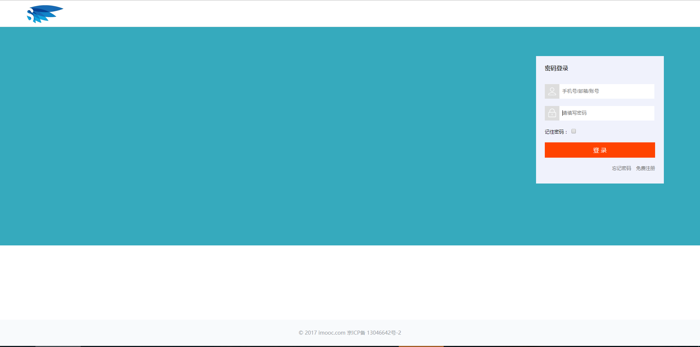

# 电商系统JS-SDK
The JS-SDK scheme provides an SDK for e-commerce applications.


### 目录结构

```bash
├── /dist/           # 项目输出目录
├── /src/            # 项目源码目录
│ ├── /css/       # 样式文件
│ ├── /html/       # UI组件
│ │ ├── /templates/       # 公共UI组件
│ │ │ ├── footer.html       # UI组件底部版权信息
│ │ │ ├── header.html           # UI组件头部版权信息
│ │ │ ├── sidebar.html          # UI组件-账号管理
│ │ │ └── step.html             # UI组件-设置
│ │ ├── common-success.html     # 
│ │ ├── delivery-address.html    # 
│ │ ├── forget.html              # 
│ │ ├── login.html              # 
│ │ ├── profile.html               # 
│ │ ├── register-info.html      # 
│ │ ├── register-mobile.html    # 
│ │ ├── register-payment.html    # 
│ │ ├── register-success.html    # 
│ │ └── security.html           # 
│ ├── /images/                  # 
│ ├── /js/                      # 
│ │ ├── /common/            # 公共方法
│ │ │ ├── /data/            # mock数据
│ │ │ │ └── region-data.js    # 用户信息mock数据
│ │ │ ├── fetch.js              # Fetch请求封装
│ │ │ ├── form-check.js         # 验证信息
│ │ │ ├── mock.js               #  mock数据
│ │ │ ├── polyfill.js           #  打包文件引用
│ │ │ ├── region.js            #  滑块验证插件
│ │ │ ├── slider.js             #  滑块验证插件
│ │ │ └── utils.js            # 工具类
│ │ ├── /delivery-address/       #  收货地址管理
│ │ │ ├── event.js              # 收货地址管理-方法类
│ │ │ ├── init.js               #   收货地址管理-初始化类
│ │ │ └── render.js             #   收货地址管理-为上游提供SDK
│ │ ├── /forget/                # 找回密码
│ │ │ ├── event.js              # 找回密码-方法类
│ │ │ ├── findTpl.js            #  找回密码-html模板  
│ │ │ ├── init.js               # 找回密码-初始化类
│ │ │ └── render.js             # 找回密码-为上游提供SDK
│ │ ├── /login/                 # 登录
│ │ │ ├── event.js              # 登录-方法类
│ │ │ ├── init.js               # 登录-初始化类
│ │ │ └── render.js            # 登录-为上游提供SDK
│ │ ├── /register/              #  注册
│ │ │ ├── /info/               #  注册-第二步，填写账号信息
│ │ │ │ ├── event.js          #  
│ │ │ │ ├── init.js           # 
│ │ │ │ └── render.js         # 
│ │ │ ├── /mobile/             #  注册-第一步，设置用户名
│ │ │ │ ├── event.js          # 
│ │ │ │ ├── init.js           # 
│ │ │ │ └── render.js         # 
│ │ │ └──  /payment/            #  注册-第三步， 设置支付方式
│ │ │    ├── event.js          # 
│ │ │    ├── init.js           # 
│ │ │    └── render.js         # 
│ │ └── /security/              #  注册-第四步， 注册成功
│ │    ├── event.js             # 
│ │    ├── init.js              # 
│ │    └── render.js             # 
│ │    ├── register-success.html    # 
│ │    └── security.html       # 
│ └── /lib/                     # lib库
├── package.json                # package配置
├── html-bundler.config.js      # hb工具配置
├── webpack.config.js           # webpack配置
└── webpack.dll.js              # webpack,dll配置
```


### 快速开始

进入目录安装依赖:

```bash
#开始前请确保没有安装webpack到NPM全局目录
npm i 或者 yarn install
```

开发：

```bash
hb dll #第一次npm run dev时需运行此命令，使开发时编译更快
hb dev
打开 http://localhost:8008
```

####技术栈
```bash
fetchMock
webpack
babel
es6-polyfill
```
